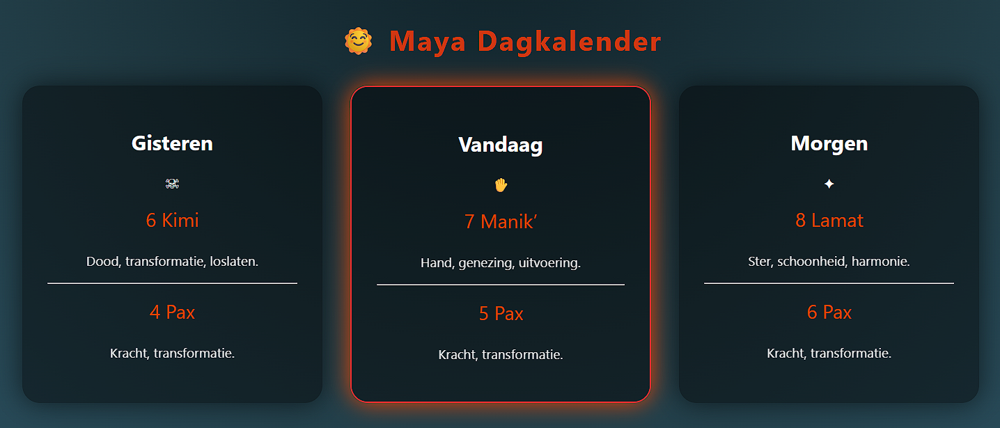

# 🌞 Maya Calendar Engine — Tzolk’in & Haab

Een interactieve Maya-kalender die de **Tzolk’in (260 dagen)** en **Haab (365 dagen)** combineert in één visuele, educatieve en rituele webapp.

Het project bestaat uit:

-  een Python FastAPI kalender-engine  
-  een moderne frontend (HTML/CSS/JS)  
-  glyph-gebaseerde dagweergave  
-  gisteren / vandaag / morgen vensters  

---

##  Features

- Correcte Maya Calendar Round (Tzolk’in + Haab)  
- Verankerd op moderne correlatie  
- Automatische dagverschuiving  
- Dagbetekenissen  
- Voorbereid voor glyph-visualisaties en wielen  
- Geschikt voor educatie, spiritualiteit en kunstprojecten  

---

